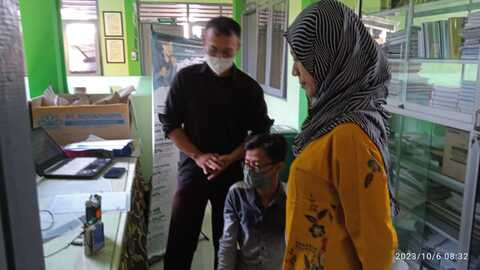

# Normal Data Collections

## Data Collection Directory
- Lab (June 2023): [Directory](https://github.com/VibrasticLab/ehealth-iot/tree/master/coughgui/olahdata/normal/lab_062023).
- Probolinggo (October 2023): [Directory](https://github.com/VibrasticLab/ehealth-iot/tree/master/coughgui/olahdata/normal/probo_07102023).

## Processing Example

Here some Python example for processing audio example: [Notebook](https://github.com/VibrasticLab/ehealth-iot/blob/master/coughgui/olahdata/TestMFCCF0.ipynb).

## Documentation

### Probolinggo

Coming to Public Health Care:

Form of Consent:

Briefing:

Cough Sampling:

Personels:

### Lab

Not Found
